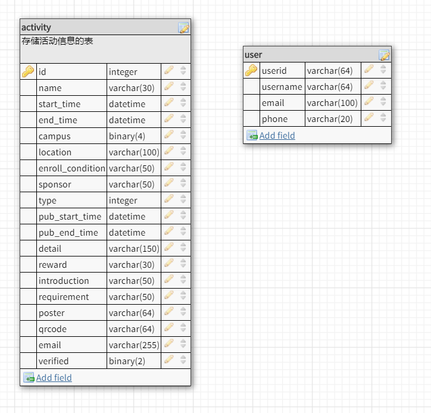

# 软件技术说明文档

## 前后端任务

### 前端

前端需要根据需求文档，完成个人页面，并于用户进入个人页面时，检查用户登录状态，若未登录，则发起登录请求，并对返回值进行存储处理；同时，前端还需要对用户的个人信息进行请求，目前仅请求头像信息即可

### 后台

后台需在每次用户调用登录时，从微信后台获取用户的身份标识，并根据是否已存在决定是否进行存储，同时需要生成一个用户标识token返回

## 接口参数说明

### User Collection [/users]

#### POST /users

##### Request

- code

  在前端向微信服务端发起登录请求后，微信服务端将会返回包含code字段的json值，前端需要将该code值于**5分钟内**发往服务端进行下一步处理

##### Response

- token

  返回用户的状态标识，该字段包含不可修改的信息，前端在接收到之后需要对内容进行合法性验证，具体的验证方式在之后给出，完成验证后进行存储，这个字符串将作为该用户此次登录期间的唯一权限验证途径

## 技术内容

### token

[参考资料](https://www.jianshu.com/p/576dbf44b2ae)

header：

```json

{
    'type': 'JWT',
    'algo': ''
}
```

payload:

```json

{
    'sub': 'userid',
    'iat': 'time is ms',
    'exp': 'time in ms'
}
```

加密算法：HS256

提示：前后端均可以用已有的库，从而简化工作

## 数据库

