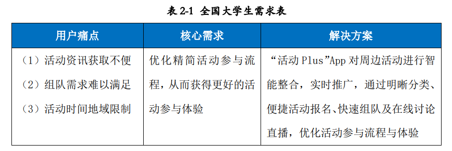
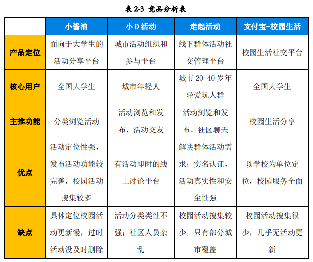

# 用户调研
为了解目标用户的真实需求，“中大活动”团队采取了访谈法和问卷法对于全国大学生目标用户进行了用户调研。其中全国大学生以中山大学学生为样本。

根据用户调研结果，我们分析了目标用户的需求，并针对目标用户的痛点和需求提
出了产品的解决方案，具体如下：

## 全国大学生需求 
全国大学生是校园活动的参与者，各式各样的校园活动能够让这类用户感受到大学生活
的丰富多彩。但由于传统活动参与方式的限制，往往造成该类用户体验不佳。

### 活动资讯获取不便
校园活动资讯的传统接收形式存在局限性。对于一个学生来说，校内校外活动获取的渠
道相当有限，通常有线下的海报以及线上的公众号这两大方式。线下渠道的痛点在于海报杂
乱无章筛选困难、驻足围观体验糟糕、从看到海报到报名活动体验不畅。线上渠道的痛点则
在于信息碎片化严重，难以完整地了解到最近一共有哪些活动；此外，主办方的活动推送常
常长篇大论，信息太多太杂，看不到重点。该类用户在获取所需的活动资讯的过程中，往往
费时费力、体验不佳，甚至会错过一些合适的优质活动。

### 活动组队需求
部分校园活动（例如比赛、定向越野等）有队伍组建的要求，而大学生往往在组队的过
程中耗费大量的精力，却找不到志同道合的小伙伴。传统的队伍组建一般是通过人脉关系网
进行，由于人脉资源的限制和信息传递的延滞性，不能很好地将缺特定人手的团队和具有相
应能力的学生进行高效地匹配，难以解决该类用户的需求。

### 活动时间地域限制 
在活动参与流程中，活动时间地域限制给大学生用户群体所带来的问题也通常难以得到
解决。由于时间冲突或者交通不便，该类用户对于自己所感兴趣的活动有时并不能亲临现场
参与。用户想获取对应活动的动态往往只能通过活动的后续报道，内容静止、碎片、局限，
无法获得活动参与的积极体验。

综上，作为“Activity+”平台活动资讯的消费者，该类用户的核心需求是优化精简活动参与流程，从而获得更好的活动参与体验。

# 市场调研
## 目标市场概况 
### 目标市场容量 
2016 年 4 月 7 日，教育部首次发布《中国高等教育质量报告》。报告称，2015 年在学总
规模 3647 万人（其中普通高校本专科 2625 万人），位居世界第一。说明大学生市场广阔，
用户群体规模庞大。可以大致估算：
“活动 Plus”在全国的市场容量约有 4000 万人，相当可观。

### 大学社团组织数目
一份大学生社团调查报告显示，我国每所高校平均有 30 多个社团，每个社团一年会举
办约 3-10 个大型活动。像北大清华、复旦上交、中山大学这样的综合性大学，社团数目更
是有上百个之多。毫无疑问，社团活动已经成为丰富校园文化的重要平台。而以校园活动为
切入点，首先把握大学社团组织群体，打造校园活动资讯平台，具有极大的市场发展空间。

### 大学生参与活动频率 
就中大学生而言，调研结果显示，一个大学生一年参加的大小活动高达 10 多个，包括
比赛、定向越野、公益活动、讲座等，我国其余高校的活动参与情况应该与中大差异不大。
由此可见，校园活动是大学生活中至关重要的一部分，各式各样的校园活动能够满足大学生
用户群体娱乐、竞争、公益奉献、经验获取等方面的需求，用户参与度和积极性高。通过“活
动 Plus”优化大学生活动参与体验，具有可行性与广阔的发展前景。

# 竞品调研
为了充分了解项目所处领域的当前市场发展状况和进行程度，我们进一步对“活动 Plus”
进行了竞品分析。我们挑选了小酱油、小 D 活动、走起活动和支付宝的校园生活四款竞品，
根据产品定位、核心用户、主推功能、优点和缺点五方面，优先针对他们在 Android 平台上
做了分析。并根据分析的结果，找出“Activity+”产品的核心竞争力。

基于用户群体的需求，对比以上市面上已有的活动资讯平台，“Activity+”具
有如下几点核心优势：

## 针对性强 
“Activity+”着眼于高校活动细分市场，侧重校园活动，以全国大学生为核心用户群体，定位明确。通过精准匹配活动参与者，能够更具针对性地满足校园
活动参与中的用户需求。

## 智慧分类整合 
“活动 Plus”App 将对校园活动按照活动类别进行精准的分类整合，通过清晰的类别引
导和简洁全面的活动基本信息，让大学生活动参与者对于感兴趣的活动一目了然。

## 活动全面及时
通过和校园社会组织和校外组织达成长期合作关系，“Acitivity+” 将做到活动的全
面搜集和及时更新。覆盖用户所在高校的大部分校园活动，自动对于过期活动进行筛查，并
及时添加最新活动信息，带给用户更好的活动资讯获取体验。

## 活动参与一站式服务 
“Acitivity+”不仅仅是一个活动资讯整合和活动管理平台，除了将资讯整合和活
动管理做精之外，我们还考虑到了用户组队、在线讨论及观看活动的需求，计划开发线上组
队、讨论和活动视频直播功能。通过向全国大学生提供活动参与一站式服务，并重构用户参
与活动的形式（线上互动交流），进一步优化用户体验，增强活动参与的趣味性。