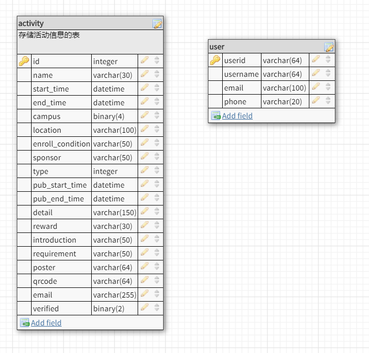

# 软件技术说明文档

## 后台所需环境变量

- DEVELOP

  确定当前环境是否为开发环境，若为开发环境，则设为true，否则为false；后台代码会根据这一变量值决定是否显示debug信息及其他相关内容

- PORT

  指明服务器运行所在端口，后台会根据这一环境变量决定绑定端口，默认为8080

- DATABASE_ADDRESS

  指明数据库地址，若未设置，默认为localhost

- DATABASE_PORT

  指明数据库暴露的端口，如为设置，默认为3306端口

- REDIS_ADDRESS

  指明redis地址，若未设置，默认为localhost

- REDIS_PORT

  指明redis端口，若未设置，默认为6379端口

## 其他软件要求

- 数据库

  mysql，提供数据库服务；redis，提供内存数据库支持

- 网关

  nginx作为代理

## 前后端框架

  前端使用小程序，后台使用go语言

## 接口参数说明

### Activity Collection [/act]

#### GET /act?page={pageNum}

##### Request

- pageNum

  按照需求文档说明，这个参数指定了前端所需的活动列表的页码数，默认每页最多为10个活动，例如：当前端进入活动列表页面时，此时需要第一页的数据，而当前端上拉到需要加载下一页时，则需要像后台发出pageNum为2的请求

##### Response

- content

  json数组，用以存储后台根据前端页码查询到的所有活动列表及相关信息，以下为具体字段内容

  - id

    活动id号，用以唯一地标记某一个活动

  - name

    活动名称

  - startTime

    毫秒时间表示的活动起始时间

  - endTime

    毫秒时间表示的活动结束时间

  - campus

    活动面向的校区，采用二进制方式编码，最后四位分别代表东、南、北、珠，例如：0b0001代表珠海校区。需要注意的是，这里可能不止一位为1，即活动面向的校区可能不止一个

  - type

    活动类型，具体参见下方给出的对应表(暂时还没有完成)

  - poster

  活动的海报名称，所有海报图片将会被取64位摘要后存储

  - location

  活动举办的详细地址

#### GET /act/{id}

  详情请见数据库的表头说明

## 数据库表头说明

- id

  活动id号，用以唯一地标记某一个活动

- name

  活动名称

- start_time

  毫秒时间表示的活动起始时间

- end_time

  毫秒时间表示的活动结束时间

- campus

  活动面向的校区，采用二进制方式编码，最后四位分别代表东、南、北、珠，例如：0b0001代表珠海校区。需要注意的是，这里可能不止一位为1，即活动面向的校区可能不止一个

- location

  活动举办的详细地址

- enroll_condition

  报名条件

- sponsor

  (TODO)

- type

  活动类型，具体参见下方给出的对应表(暂时还没有完成)

- pub_start_time

  开始展示的时间

- pub_end_time

  结束展示的时间

- detail

  活动详细信息

- reward

  活动的奖励

- introduction

  活动的简介

- requirement

  参加活动的要求，可以理解为面向群体

- poster

  活动的海报名称，所有海报图片将会被取64位摘要后存储

- qrcode

  二维码地址，具体存储方式和海报相同

- email

  发布方邮箱

- verified

  是否通过验证，默认状态为0，当系统管理员审核通过，状态变为1，未通过变为2
