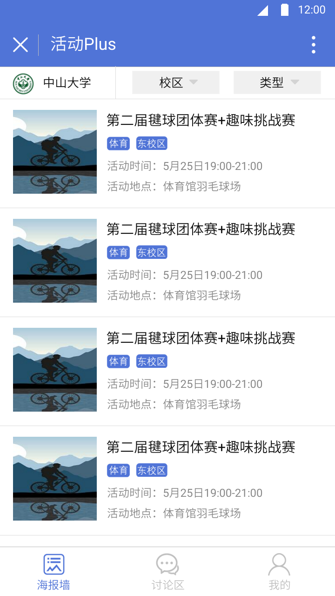
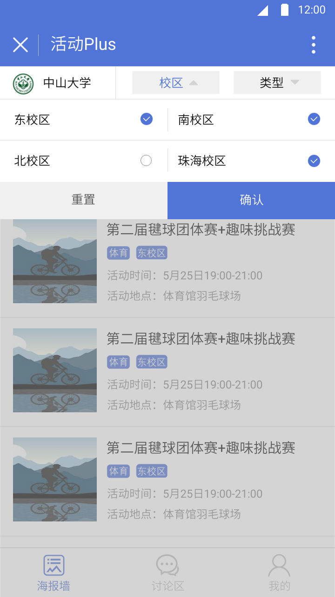
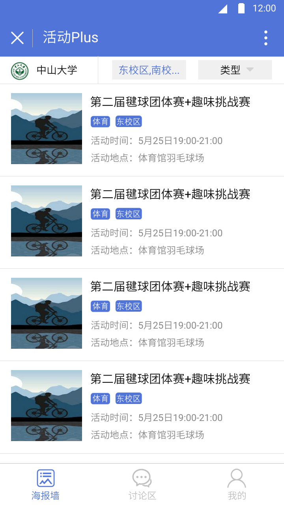
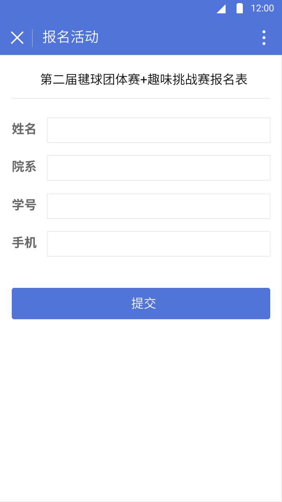
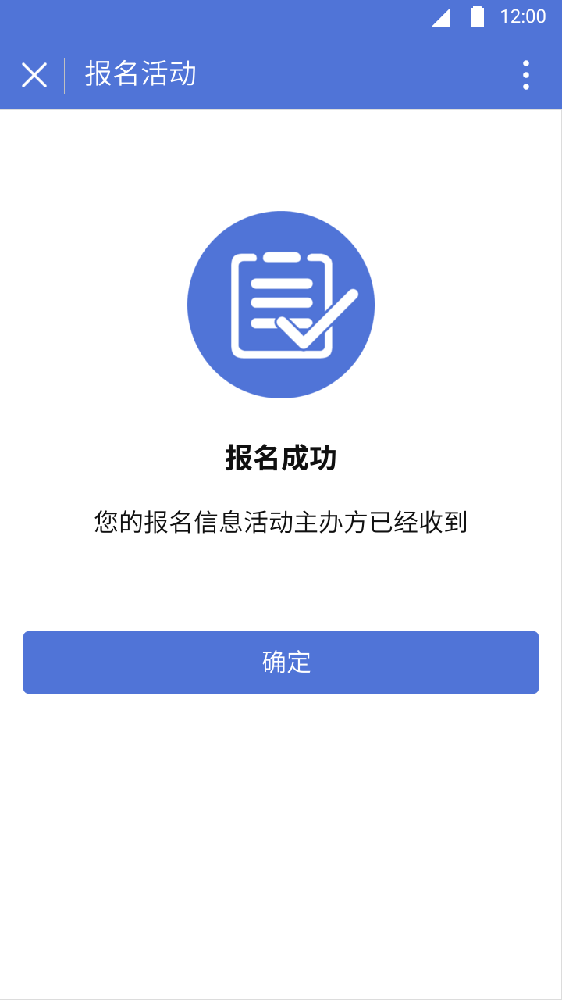
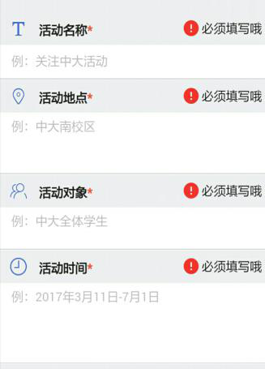

# 软件需求说明书

###                                      修订历史记录

| 日期      | 版本 | 说明 | 作者           |
| --------- | ---- | ---- | -------------- |
| 2018/3/22 | V1.0 | 初稿 | 冼圣杰、陶文宇 |
|           |      |      |                |
|           |      |      |                |

## 1. 引言

​	校园生活中活动是不可或缺的一部分，而活动的发布与参加以及组队过程往往是被繁琐的过程阻碍，甚至是因为没有合适的平台去进行多方的沟通而停止进行活动。这就需要有一个适合大学生的平台去发布和获取附近活动信息并参与其中。

​	“活动 Plus”微信小程序，在这些方面有无可比拟的优势。小程序的便捷性，降低用户的使用成本。基于学校的活动发布，满足用户最需要的功能。这些优点极大地提高了活动组织过程的效率，是当下快节奏高效学校生活的必需。

### 1.1 编写目的

​	这份需求规格说明书是需求分析阶段的产物，在经过对预期受众（中山大学大学生）的调研之后，详细的了解了该系统所要实现的功能与用户的习惯后所形成的文档汇总。通过这个文档的书写能够明确以后项目的进度与规划，组织软件的开发与测试。

​	本文档面向多种读者对象：

- 项目经理：项目经理可以根据该文档了解预期产品的功能，并据此进行系统设计、项目管理。  
- 设计员：对需求进行分析，并设计出系统，包括数据库的设计。 
- 程序员：了解系统功能，编写《用户手册》。 
- 测试员：根据本文档编写测试用例，并对软件产品进行功能性测试和非功能性测试。 
	 用户：了解预期产品的功能和性能，并与分析人员一起对整个需求进行讨论和协商。	

### 1.2 背景

​	日常生活中经常会遇到组织活动方面的困难。例如社团组织想要发起体育挑战赛，却苦于没有合适的平台发布，大多数情况下选择问卷调查等不直观的方式进行报名，也难以传播。假如有同学想要参加活动丰富课余生活，也只能随时关注海报和朋友圈信息，很容易错过。

​	此小程序由我们系统分析与设计小组（唐玄昭、肖雨蓓、宋思婷、陶文宇、谭梓豪、夏显茁、魏兆基、冼圣杰）合作开发，主要适用对象是在校大学生，用于校内活动的创建、发布和参与。

### 1.3 定义

| 序号 | 名词   | 定义                                                         |
| ---- | ------ | ------------------------------------------------------------ |
| 1    | 小程序 | 微信小程序，简称小程序，英文名Mini Program，是一种不需要下载安装即可使用的应用，它实现了应用“触手可及”的梦想，用户扫一扫或搜一下即可打开应用。 |

### 1.4 参考文献

## 2.任务概述

### 2.1 目标

​	开发一款浏览活动，在线活动报名，在线活动组队，在线活动讨论和分享平台。

### 2.2 用户的特点
      大学生比较喜欢接触新的互联网产品，因为该用户群处在知识探索的过程中，对新东西接触较快，而且校园里注重口碑的，如果产品做的好就会很快被推广蔓延。大学生市场的门槛相对较低，相对容易进行产品的推广。
      ​大学生的消费能力有限，产品要走向商业的模式，需要产品细化需求与市场，提供个性化服务和套餐。
      ​​每年都会有大学生即将毕业，走入社会，他们就会成为产品流失的用户群，留住即将流失的大学生用户群是需要思考的问题。
### 2.3 假定与约束

​	本软件的开发时间大致为2018年春季学期，无经费投入，前期需求分析与设计，中期进行前后端代码实现与优化，后期进行软件的测试。

## 3. 需求规定

### 3.1 对功能的规定

#### 3.1.1 功能1（海报墙）描述

图1-1

图1-2

​图1-3

图1-4

图1-5

图1-6

------

##### 3.1.1.1 活动列表界面

用户场景：用户进入小程序或者点击导航栏的“海报墙”，可看到活动列表（图1-1）。

功能描述：展示出管理员页面审核通过的活动列表。

**逻辑&流程详述：**

【页面整体交互】

​	活动列表默认列出10个活动，上拉一次可再加载10个活动。

【页面跳转交互】

​	1.点击页面中的每条列表项的区域（整条列表项的区域均为有效点击区域），进行页面跳转，跳转至【活动详情】页面：图1-4；

​	2.点击顶部选框“校区”按钮，上方弹出“选校区”的浮层：图1-2,选择类型点击“确定”后跳转至相对应的校区【活动列表】页面：图1-3，“重置”后清空用户选择的类型；选择类型的交互方式同选择校区。

​	3.【导航栏跳转】： 点击底部导航栏“讨论区”图标进入【讨论区】帖子列表页面, 点击底部导航栏“我的”图标进入【我的】页面。

【页面元素呈现】
    1. 类型和校区默认为显示“类型”，“校区”，点击“校区”按钮，弹出4个选择项,设置为多选项（选择东校区，南校区，北校区，珠海校区），点击“类型”按钮，弹出7个选择项,设置为多选项（可选择体育，公益，比赛，讲座，演出，户外，休闲）;
    2. 点击“确定”按钮后，将用户选择的校区和类型对应填入框中并显示出来(注明：当选择多个校区时,显示不下时使用省略号表示）：例如校区选择东校区确定后，“校区”处填入并显示为”东校区“,校区选择东校区,南校区,珠海校区确定后，“校区”处填入并显示为”东校区，南校区...“（详见图1-3页面顶部,显示优先级见补充说明）
    3. 活动列表：活动封面：如发布者有上传则采用上传的海报，若无则显示对应活动类型的默认图片；两个标签：活动类型，活动校区（活动对象所在的校区）；活动地点（活动进行的具体地点）和活动时间（注：活动时间和地点最多显示1行的文字，超过一行采用省略号...进行显示）。

> **补充说明** ：
>
> 1. 选学校的功能暂时不实现，点击学校的按钮处无页面变化
> 2. 校区显示优先级：东校区，南校区，珠海校区，北校区
> 3. 类型显示优先级：体育，公益，比赛，演出，户外，休闲，讲座
> 4. 活动列表的顺序:按照发布时间的先后顺序进行排列,先发布的排在前.户外，休闲

------

##### 3.1.1.2 活动详情

用户场景：用户点击活动列表页面中的每条列表项的区域，可进入活动详情页面（图1-4）

功能描述：展示出所有有关该活动的信息

**逻辑&流程描述**：

【页面整体交互】

1. 活动详情若内容多可上下滑动进行查看；
2. **“报名该活动”** 按钮固定在页面底部。

【页面跳转交互】

1. 点击页面下方中的“**报名该活动**”的区域：
   - 若活动尚可进行报名，进行页面跳转，跳转至【填写报名表】页面：图1-5；若活动不开通报名通道则不显示“报名该活动”按钮；
   - 若活动报名人数达上限或用户已报名该活动则”报名该活动“按钮区域置灰，不可进行页面跳转。

【页面元素呈现】

1. 页面下方中的报名区域：
   - 若活动尚可进行报名，按钮显示为有效按钮：**"报名该活动"**；

- 若活动不开通报名通道则不显示“**报名该活动**”按钮；
- 其他情况按钮置灰且在按钮处的文本根据不可报名的原因进行填写，例如：**“报名人数已达上限”**，**“已报名该活动”**。

> **补充说明**：
>
> 1. 活动详情下方的可进行评论，该功能暂时不实现。
> 2. 灰色：`#f7f7f7`，有效按钮颜色：`#5074d7`

------

##### 3.1.1.3 活动报名

用户场景：用户点击“**报名该活动**”的区域，可进入活动报名页面（图1-5）

功能描述：展示出该活动要求所有用户要填写的信息（包括选填和必填）

**逻辑&流程详情**：

【页面整体交互】

填写项多可上下滑动进行查看；

【页面跳转交互】

1. 正确填写完报名信息后点击页面下方中的“**提交**”的区域，进行页面跳转，跳转至【报名成功】页面（图1-6）。【报名成功】页面点击“**确定**”按钮后跳转至原先的【活动详情】页面（图1-4）。
2. 填写完成但格式出现错误点击提交后显示格式错误提醒（图a）：
   - 在对应项后使用`!`图标和文本“**格式有误**”进行说明。
3. 若有漏填则**“提交“**按钮置灰，点击无效，呈现漏填错误提醒（图b）：
   - 在对应项后使用`！`图标和文本“**必须填写哦**”进行说明。

图a

图b

> 补充说明
>
> - 灰色： `#f7f7f7`
> - 有效按钮颜色蓝色：`#5074d7`

## 4. 运行环境规定

### 4.1 设备

​	手机等移动设备。

### 4.2 支持软件

​	

### 4.3 接口

### 4.4 控制

 

