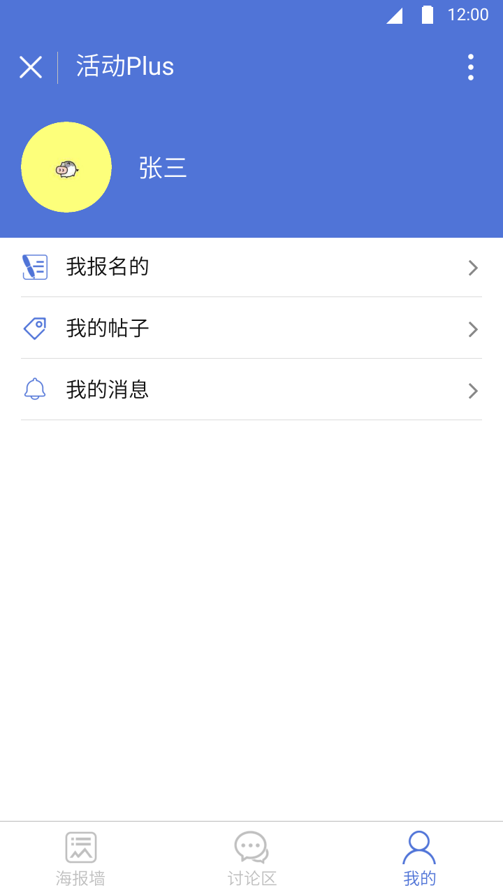
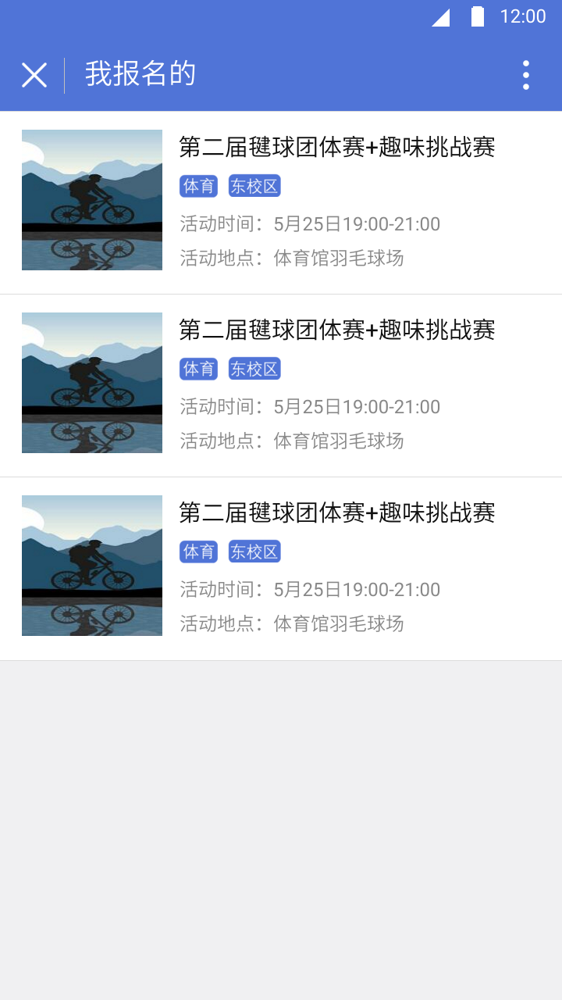
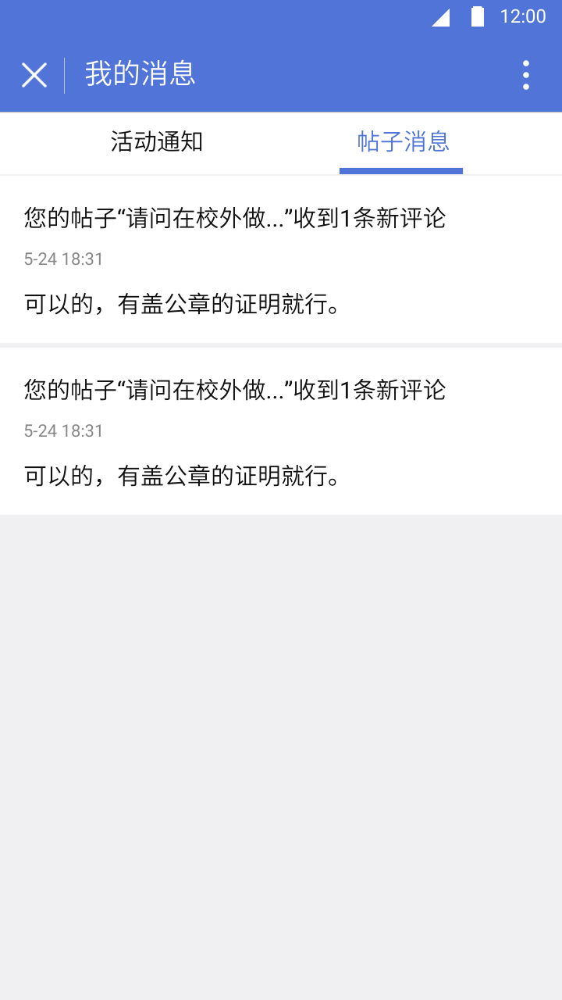

# 软件需求说明书-iter-2

###                                      修订历史记录

| 日期      | 版本 | 说明 | 作者           |
| --------- | ---- | ---- | -------------- |
| 2018/4/11 | V1.0 | 初稿 | 冼圣杰、陶文宇 |
|           |      |      |                |
|           |      |      |                |

### 本次迭代主要需求：

> 完成小程序端的三大主要功能之一：“我的”。
>
> 【我的】页面应该能连接到其他页面：
>
> ​	【我报名的】连接到用户报名了的活动页面。
>
> ​	【我的帖子】连接到用户发表过的帖子页面（讨论区）。P.S. 由于讨论区仍未实现，所以可以暂缓。
>
> ​	【我的消息】：一个新的页面，包括【报名的活动开启】的通知、【他人对用户帖子的评论】的通知。

---

#### 3.1.2 功能2（我的）描述

> 图片引用：

图2-1

图2-2

图2-3

图2-4

图2-5

##### 3.1.2.1 ”我的“界面

用户场景： 微信登录权限的用户点击导航栏的`“我的”`，可进入`“我的”`页面（图2-1）。

功能描述：展示用户个人相关信息。

**逻辑&流程详述**

【页面跳转交互】

​	1.点击页面中的”我报名的“区域，进行页面跳转，跳转至【我报名的】页面：图2-2，即用户报名过的活动列表。

​	2.点击页面中的”我的帖子“区域，进行页面跳转，跳转至【我的帖子】页面：图2-3，即用户发布过的帖子列表。

​	3.点击页面中的”我的消息“区域，进行页面跳转，跳转至【我的消息】页面：图2-4，即用户报名过的活动的主办方发出的消息和发布的帖子收到的回复。

​	4.类似活动列表的【导航栏跳转】交互。

> **补充说明**
>
> 1. 【我的收藏】，【我的回帖】，设置部分暂时不实现。
> 2. 拒绝微信登陆授权的用户只能使用查看活动列表,浏览活动详情,查看帖子列表和帖子详情的功能,点击导航栏下方的”我的”,”报名该活动”或者发布帖子或者评论的按钮将再次弹出询问是否同意微信登陆授权框要求必须获取用户的头像和微信昵称后才能使用这些功能。

---

##### 3.1.2.2 ”我报名的“界面

用户场景： 用户点击导航栏“我的”页面中的“我报名的”，可看到用户报名过的活动列表（图2-2）。

功能描述：展示出所有报名过的活动列表。

**逻辑&流程详述**

【页面整体交互】

​	点击页面中的每条列表项的区域，进行页面跳转，跳转至【活动详情】页面：图2-4。

【页面元素呈现】

​	活动列表：活动封面：如发布者有上传则采用上传的海报，若无则显示对应活动类型的默认图片；两个标签：活动类型，活动校区（活动对象所在的校区）；活动地点（活动进行的具体地点）和活动时间。

> **补充说明**
>
> 活动列表顺序按照报名时间距离现在的时间长短进行排序，最近报名的排在前

------

##### 3.1.2.3 ”我的帖子“界面

用户场景：用户点击导航栏“我的”页面中的“我的帖子”，可看到用户发布过的帖子列表（图2-3）。

 功能描述：展示出所有发布过的帖子列表。

**逻辑&流程详述**

【页面整体交互】

​	 帖子列表默认展示出10个该用户发布过的帖子，上拉一次可再加载10个。

【页面跳转交互】

​	点击页面中的每条列表项的区域，进行页面跳转，跳转至【帖子详情】（未实现）。

【页面元素呈现】

​	帖子列表中每个帖子包括：帖子发布者头像，昵称，发布时间(格式：xx分钟/小时/天前），帖子内容（最多显示6行），帖子类型（如果有则显示，没有则不显示类型标签），评论数。

> **补充说明**
>
> 帖子列表顺序按照发布时间距离现在的时间长短进行排序，最近发布的排在前。

------

##### 3.1.2.3 ”我的帖子“界面

用户场景：用户点击导航栏“我的”页面中的“我的消息”选项，可看到用户的消息列表（图2-4）。

 功能描述：展示出所有活动消息和帖子消息列表。

**逻辑&流程详述**

【页面跳转交互】

​	1.在【我的消息】页面点击“活动信息”按钮，跳转至“活动信息”子页面，显示社团组织发送的信息。

​	2.在【我的消息】页面点击“帖子信息”按钮，跳转至“帖子信息”子页面，显示发布过的帖子收到的评论。

【页面元素呈现】

​	1. 帖子信息列表中每个帖子信息包括：发布的帖子内容，评论时间(格式为月-日小时：分钟：“xx-xxxx:xx”），评论内容，详见图2-5。

​	2.活动信息列表中每个信息包括：活动标题，消息发送时间(格式为月-日 小时：分钟：“xx-xx xx:xx”），活动主办方，消息内容，详见图2-4。

> **补充说明**
>
> 消息列表顺序按照时间距离现在的时间长短进行排序，最近收到的排在前。

