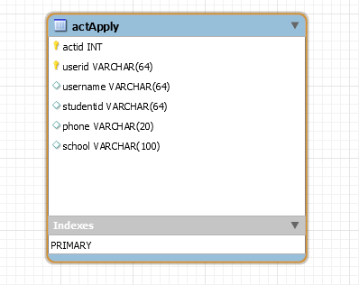

# 软件技术说明文档

接口参数说明


## Activity Apply Collection [/actApplys]

### User sign up certain activity [POST /actApplys/{actId}]

- actid
  报名的活动id --- type(INT)

#### Request

- HEADERS

  - Authorization: token_string

- BODY

  - username
    报名时填写的用户名 --- type(STRING)

  - studentid
    报名的用户学号 --- type(STRING)

  - phone
    报名时填写的联系方式 --- type(STRING)

  - school
    报名时填写的邮箱 --- type(STRING)

#### Response

- 200
  报名填写成功

- 400
  bad request，请求语义有误

- 401
  用户未登陆(不含有token)或用户token错误或超时，或该用户token对应的用户id不存在，需要重新登陆

- 500
  服务器错误

### User get registration list [GET /actApplys?page={pageNum}]

#### Parameter

- pageNum: `2` (number, optional) - Specified the page number

  - Default: `1`


#### Request

- HEADERS

  - Authorization: token_string

- BODY

  - empty

#### Response 

- 200
```
{
  "content": [
    {
      "id": 28, 
      "name": "三月义卖", 
      "startTime": 1521734400000,
      "endTime": 1521820800000, 
      "campus": 0b0000, 
      "type": 0,
      "poster": "imagename",
      "location": "具体地点",
      "studentId", "15331321"
    }
  ]
}

```

- 204 该用户未报名任何活动

- 400
  bad request，请求语义有误

- 401
  用户未登陆(不含有token)或用户token错误或超时，或该用户token对应的用户id不存在，需要重新登陆


- 500
  服务器错误

## 数据库表头说明



- actid
  报名的活动id

- userid
  报名的用户openid

- username
  报名时填写的用户名
                
- studentid
  报名时填写的用户学号

- phone
  报名时填写的联系方式

- school
  报名时填写的学院