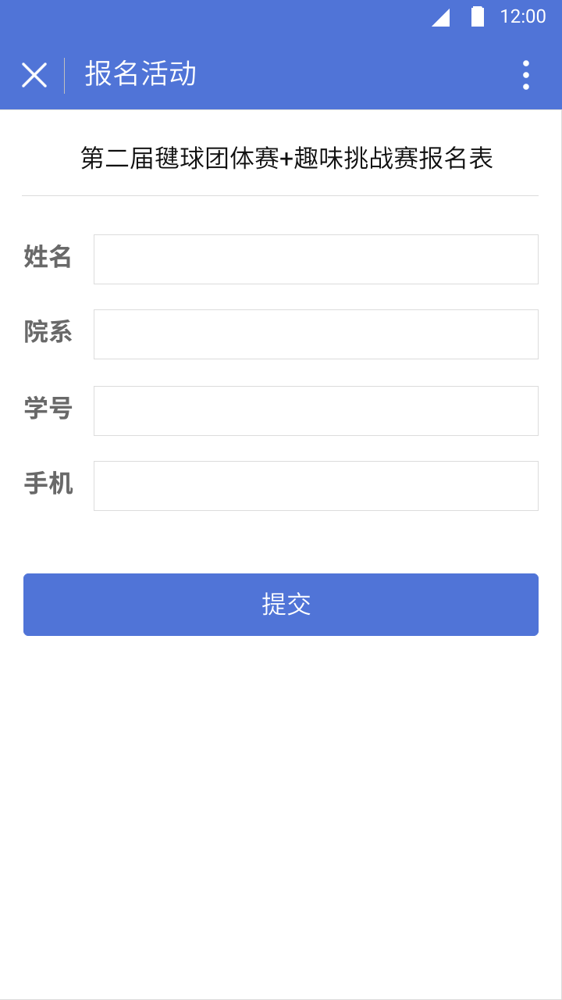
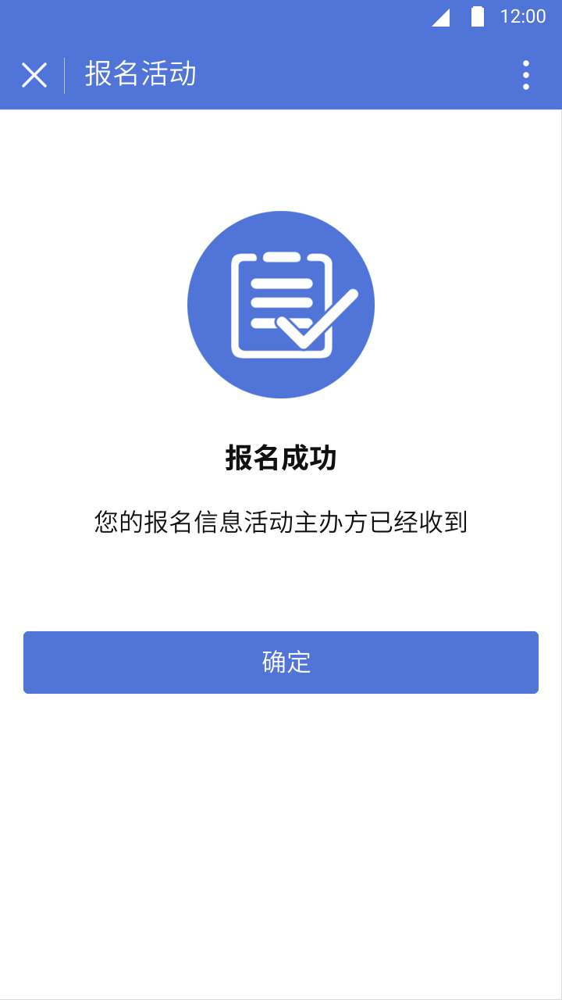
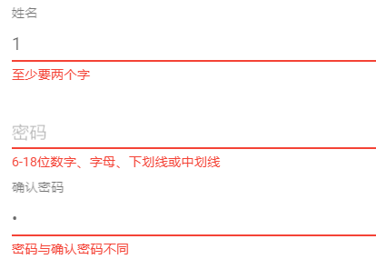

# 用例：报名活动

## 范围：
中大活动应用活动报名

## 级别： 
子功能

## 主要参与者：
中大师生（活动参与者）、各校内组织（活动发布者）

## 涉众及其关注点：
- 中大师生（活动参与者）：希望能够准确、快速地输入，且系统会保存输入的内容。希望得到成功提交报名申请的反馈。
- 各校内组织（活动发布者）：希望能够完整地收集参与者填写的信息。

## 前置条件：
中大师生（活动参与者）已经阅读活动详情，并决定报名活动

## 成功保证：
系统提交报名信息并储存

## 主成功场景：
1. 中大师生（活动参与者）点击活动详情页面的**报名该活动**按钮，跳转到报名活动页面(图3-1)
2. 中大师生（活动参与者）填写姓名、院系、学号、手机等信息，点击**提交**按钮
3. 前端检查表单信息，若符合规则，则提交到服务器；若不符合规则，则提示错误，用户重新输入。
4. 服务器检查表单信息，若符合规则，则保存信息，返回前端保存成功的信息；若不符合规则，返回前端错误信息。
5. 前端接收返回的信息，若是成功的信息，则跳转到报名成功页面(图3-2)；若是错误信息，则提示错误。

## 扩展：
1. 无效的活动（在提交报名信息时，该活动已经失效（人数已满或活动已取消））：
   1. 服务器返回活动已经失效的信息。
      1. 系统回到活动详情页面，更新活动信息。
2. 系统与服务器之间存在通信故障：
   1. 系统重新向服务器提交表单。
      1. 系统检测到无法成功重启服务。
         1. 系统提示错误，询问用户是否继续重试。
         2. 用户取消提交表单操作。

## 特殊需求：

### 前端提示
- 前端检查错误提示在焦点离开 input 时执行，以 hint 形式显示在 input 组件下方，参考图(图3-3)
  

- 后端返回错误信息，以 dialog 形式提示用户

### 前端校验
- 姓名要求：长度不小于4个字符
- 院系要求：下拉框中选择
- 学号要求：8位数字
- 手机要求：11位数字

### 后端校验

- 暂不校验表单合法性。

- 校验提交的活动id是否有效。

## 技术和数据变元表
- 表单姓名字段：文本输入框
- 表单院系字段：下拉选择
- 表单学号字段：数字输入框
- 表单手机字段：数字输入框

## 发生频率
不断发生

## 未解决问题
