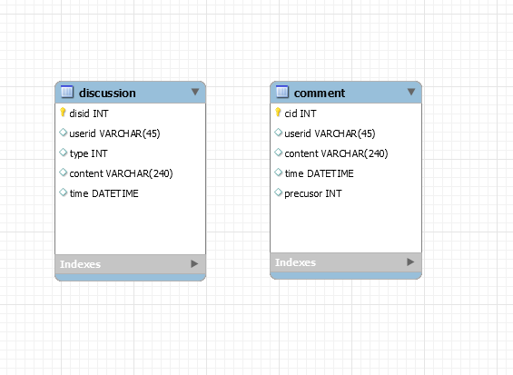

# 技术说明文档

## Acitivity Discussion Collection [/discus]

### User get newly discussion lists [GET /discus?page={pageNum}&type={typeNum}]

#### Request

- pageNum

  - 默认每页最多为10个活动。
    例如：当前端进入活动列表页面时，此时需要第一页的数据，而当前端上拉到需要加载下一页时，则需要向后端发出pageNum为2的请求

- typeNum

  - typeNum指定获取的帖子的类型，若要获取类型为组队的帖子，则设置typeNum为2。问答[4]和分享[8]，以四位二进制表示，1表示需要返回的类型，可以是多种类型的组合

- HEADERS

  - Authorization: token_string

#### Response

- 200 (application/json)


  ```
  "content": [
      {
          "disid" : 28,
          "username" : "张三",
          "type" : 2,
          "content" : "这是一条组队的帖子",
          "time" : 1521820800000
      }
  ]
  ```

- 401
  用户未登陆(不含有token)或用户token错误或超时，或该用户token对应用户id不存在，需要重新登陆

- 500
  服务器错误

### User get comments to specific discussion [GET /discus/comments?page={pageNum}&precusor={precusorNum}]

#### Request

- pageNum

  - 默认每页最多为10个活动。
    作用场景同上

- precusorNum

  - 用于指明评论的评论对象

- HEADS

  - Authorization: token_string

#### Response

- 200 (application/json)

  ```
  "content": [
    {
        "cid" : 2,
        "username" : "张三",
        "content" : "这是一条评论",
        "time" : 1521820800000,
        "precusor" : 28
    }
  ]
  ```

- 400
  bad request，请求语义有误

- 401
  用户未登陆(不含有token)或用户token错误或超时，或该用户token对应用户id不存在，需要重新登陆

- 500
  服务器错误

### User sign up certain discusstion [POST /discus]

#### Request

- HEADERS

  - Authorization: token_string

- BODY

```
  {
    "type" : 2,
    "content" : "这是一条组队的帖子"
  }
```

#### Response

- 200
  帖子发布成功

- 400
  bad request，请求语义有误

- 401
  用户未登陆(不含有token)或用户token错误或超时，或该用户token对应的用户id不存在，需要重新登陆

- 500
  服务器错误

### User sign up comment to specified discussion [POST /discus/comments]

#### Request

- HEADERS

  - Authorization: token_string

- BODY

```
  {
    "content" : "这是一条评论",
    "precusor" : 28
  }
```
#### Response

- 200
  评论发布成功

- 400
  bad request，请求语义有误

- 401
  用户未登陆(不含有token)或用户token错误或超时，或该用户token对应的用户id不存在，需要重新登陆

- 500
  服务器错误

## 数据库表头及说明



### discussion

- disid
  帖子的自增id--作为主键约束区分每个帖子

- userid
  发布帖子的用户openid

- type
  帖子类型--组队[2]、问答[4]和分享[8]

- content
  帖子内容--支持长度在240以内的字符内容(暂不支持图片)

- time
  帖子发布时间--毫秒

### comment

- cid
  评论的自增id--作为主键约束区分每个帖子

- userid
  发布评论的用户的openid

- content
  评论内容--支持长度在240以内的字符内容(暂不支持图片)

- time
  评论发布时间--毫秒

- precusor
  评论对象--帖子的id

